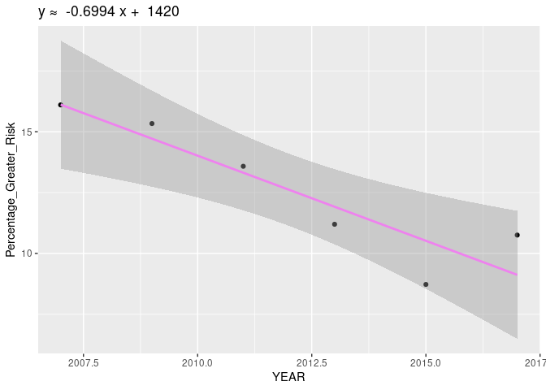
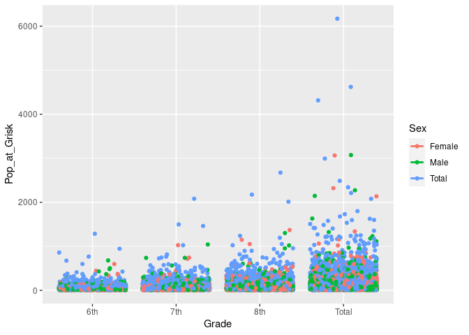

Project proposal
================
Team Hull

``` r
library(tidyverse)
library(broom)
library(here)
```

``` r
Substance_Abuse <- read.csv(here::here("data/Substance Abuse.csv"))
```

``` r
Weight_Issues <- read.csv(here::here("data/Weight Issues.csv"))
```

test

## 1. Introduction

The data we are going to be using is “Youth Risk Behavior Surveillance
System (YRBSS): Middle School”. This data has a wide range of variables
and entries from 1991-2017 that monitored young peoples behaviors
(violence; tobacco use; substance abuse; sexual health; dietary health;
and physical health). These data sets specifically focuses on substance
abuse levels and dietary Health over a 26 year period within middle
school.

This data was collected by the Centers for Disease Control and
Prevention(CDC). As of 25/10/2021, this data was last updated on March
29th, 2019.

The 35 variables in this data set are year, loactionabbr, LocationDesc,
DataSource, Topic, Subtopic, ShortQuestionText, Greater_Risk_Question,
Description, Data_Value_Symbol, Data_Value_Type,
Greater_Risk_Data_Value, Greater_Risk_Data_Value_Footnote_Symbol,
Greater_Risk_Data_Value_Footnote, Greater_Risk_Low_Confidence_Limit,
Lesser_Risk_Question, Lesser_Risk_Data_Value,
Lesser_Risk_Data_Value_Footnote_Symbol, Lesser_Risk_Data_Value_Footnote,
Lesser_Risk_Low_Confidence_Limit, Lesser_Risk_High_Confidence_Limit,
Sample_Size, Sex, Race, Grade, GeoLocation, TopicId, SubTopicID,
QuestionCode, LocationId, StratID1, StratID2, StratID3 and
StratificationType.

The question we will be looking at is the change in substance abuse and
weight issues across the span of 26 years, from 1991-2017, in middle
school students and what variables, such as race or sex, or grade, is
more susceptible to theses issues.

## 2. Data

``` r
glimpse(Substance_Abuse)
```

    ## Rows: 33,408
    ## Columns: 35
    ## $ YEAR                                    <int> 2017, 2011, 2013, 2017, 2011, …
    ## $ LocationAbbr                            <chr> "GU", "NM", "ND", "PW", "CM", …
    ## $ LocationDesc                            <chr> "Guam", "New Mexico", "North D…
    ## $ DataSource                              <chr> "YRBSS", "YRBSS", "YRBSS", "YR…
    ## $ Topic                                   <chr> "Alcohol and Other Drug Use", …
    ## $ Subtopic                                <chr> "Alcohol Use", "Alcohol Use", …
    ## $ ShortQuestionText                       <chr> "Ever alcohol use", "Ever alco…
    ## $ Greater_Risk_Question                   <chr> "Ever drank alcohol", "Ever dr…
    ## $ Description                             <chr> "other than a few sips", "othe…
    ## $ Data_Value_Symbol                       <chr> "%", "%", "%", "%", "%", "%", …
    ## $ Data_Value_Type                         <chr> "Percentage", "Percentage", "P…
    ## $ Greater_Risk_Data_Value                 <dbl> NA, NA, NA, NA, NA, NA, NA, NA…
    ## $ Greater_Risk_Data_Value_Footnote_Symbol <lgl> NA, NA, NA, NA, NA, NA, NA, NA…
    ## $ Greater_Risk_Data_Value_Footnote        <lgl> NA, NA, NA, NA, NA, NA, NA, NA…
    ## $ Greater_Risk_Low_Confidence_Limit       <dbl> NA, NA, NA, NA, NA, NA, NA, NA…
    ## $ Greater_Risk_High_Confidence_Limit      <dbl> NA, NA, NA, NA, NA, NA, NA, NA…
    ## $ Lesser_Risk_Question                    <chr> "Never drank alcohol", "Never …
    ## $ Lesser_Risk_Data_Value                  <dbl> NA, NA, NA, NA, NA, NA, NA, NA…
    ## $ Lesser_Risk_Data_Value_Footnote_Symbol  <lgl> NA, NA, NA, NA, NA, NA, NA, NA…
    ## $ Lesser_Risk_Data_Value_Footnote         <lgl> NA, NA, NA, NA, NA, NA, NA, NA…
    ## $ Lesser_Risk_Low_Confidence_Limit        <dbl> NA, NA, NA, NA, NA, NA, NA, NA…
    ## $ Lesser_Risk_High_Confidence_Limit       <dbl> NA, NA, NA, NA, NA, NA, NA, NA…
    ## $ Sample_Size                             <int> 30, 14, 0, 1, 16, 8, 7, 99, 0,…
    ## $ Sex                                     <chr> "Male", "Total", "Male", "Fema…
    ## $ Race                                    <chr> "Asian", "Asian", "White", "As…
    ## $ Grade                                   <chr> "8th", "8th", "6th", "8th", "7…
    ## $ GeoLocation                             <chr> "(13.444304, 144.793731)", "(3…
    ## $ TopicId                                 <chr> "C03", "C03", "C03", "C03", "C…
    ## $ SubTopicID                              <chr> "C14", "C14", "C14", "C14", "C…
    ## $ QuestionCode                            <chr> "M26", "M26", "M26", "M26", "M…
    ## $ LocationId                              <chr> "66", "35", "38", "204", "122"…
    ## $ StratID1                                <chr> "S8", "S1", "S8", "S7", "S8", …
    ## $ StratID2                                <chr> "R11", "R11", "R15", "R11", "R…
    ## $ StratID3                                <chr> "G19", "G19", "G17", "G19", "G…
    ## $ StratificationType                      <chr> "Territory", "State", "State",…

``` r
glimpse(Weight_Issues)
```

    ## Rows: 40,032
    ## Columns: 35
    ## $ YEAR                                    <int> 1995, 2001, 1999, 2013, 1999, …
    ## $ LocationAbbr                            <chr> "GU", "ME", "ND", "PW", "DA", …
    ## $ LocationDesc                            <chr> "Guam", "Maine", "North Dakota…
    ## $ DataSource                              <chr> "YRBSS", "YRBSS", "YRBSS", "YR…
    ## $ Topic                                   <chr> "Weight Control", "Weight Cont…
    ## $ Subtopic                                <chr> "Weight Control", "Weight Cont…
    ## $ ShortQuestionText                       <chr> "Weight loss", "Weight loss", …
    ## $ Greater_Risk_Question                   <chr> "Were not trying to lose weigh…
    ## $ Description                             <chr> "NULL", "NULL", "NULL", "NULL"…
    ## $ Data_Value_Symbol                       <chr> "%", "%", "%", "%", "%", "%", …
    ## $ Data_Value_Type                         <chr> "Percentage", "Percentage", "P…
    ## $ Greater_Risk_Data_Value                 <dbl> NA, NA, NA, NA, NA, NA, NA, NA…
    ## $ Greater_Risk_Data_Value_Footnote_Symbol <lgl> NA, NA, NA, NA, NA, NA, NA, NA…
    ## $ Greater_Risk_Data_Value_Footnote        <lgl> NA, NA, NA, NA, NA, NA, NA, NA…
    ## $ Greater_Risk_Low_Confidence_Limit       <dbl> NA, NA, NA, NA, NA, NA, NA, NA…
    ## $ Greater_Risk_High_Confidence_Limit      <dbl> NA, NA, NA, NA, NA, NA, NA, NA…
    ## $ Lesser_Risk_Question                    <chr> "Were trying to lose weight", …
    ## $ Lesser_Risk_Data_Value                  <dbl> NA, NA, NA, NA, NA, NA, NA, NA…
    ## $ Lesser_Risk_Data_Value_Footnote_Symbol  <lgl> NA, NA, NA, NA, NA, NA, NA, NA…
    ## $ Lesser_Risk_Data_Value_Footnote         <lgl> NA, NA, NA, NA, NA, NA, NA, NA…
    ## $ Lesser_Risk_Low_Confidence_Limit        <dbl> NA, NA, NA, NA, NA, NA, NA, NA…
    ## $ Lesser_Risk_High_Confidence_Limit       <dbl> NA, NA, NA, NA, NA, NA, NA, NA…
    ## $ Sample_Size                             <int> 0, 0, 4, 0, 9, 0, 0, 14, 17, 5…
    ## $ Sex                                     <chr> "Female", "Total", "Male", "Fe…
    ## $ Race                                    <chr> "Multiple Race", "White", "Asi…
    ## $ Grade                                   <chr> "6th", "6th", "7th", "Total", …
    ## $ GeoLocation                             <chr> "(13.444304, 144.793731)", "(4…
    ## $ TopicId                                 <chr> "C33", "C33", "C33", "C33", "C…
    ## $ SubTopicID                              <chr> "C34", "C34", "C34", "C34", "C…
    ## $ QuestionCode                            <chr> "M39", "M39", "M39", "M38", "M…
    ## $ LocationId                              <chr> "66", "23", "38", "204", "126"…
    ## $ StratID1                                <chr> "S7", "S1", "S8", "S7", "S8", …
    ## $ StratID2                                <chr> "R16", "R15", "R11", "R15", "R…
    ## $ StratID3                                <chr> "G17", "G17", "G18", "G1", "G1…
    ## $ StratificationType                      <chr> "Territory", "State", "State",…

## 3. Data analysis plan

The outcome (response, Y) and predictor (explanatory, X) variables you
will use to answer your question. The comparison groups you will use, if
applicable. Very preliminary exploratory data analysis, including some
summary statistics. and visualizations, along with some explanation on
how they help you learn more about your data. (You can add to these
later as you work on your project.) The statistical method(s) that you
believe will be useful in answering your question(s). (You can update
these later as you work on your project.) What results from these
specific statistical methods are needed to support your hypothesized
answer?

The Variables that will be used to answer the question will be mainly
year and and subtopic to see whether there is some sort of trend with
the way these issues develop as high schoolers complete each grade
level. Furthermore, to see the breakdown on who is affected more, sex,
race, and grade will be used in comparison. This will help us see if
there are a)ny trends, such as more people starting to abuse substances
as the approach grade x, or if male or female high school children are
more prone to having behavioral issues with weight and dietary health.

After taking a preliminary look at the dataset, we can see that the
instances of substance abuse and weight probably start to increase more
sharply from 10th grade onward. 9th grade seems to be relatively tame
with regards to these things, and each subsequent year seems to grow in
problems. We could probably look to statistical methods such as
calculating the mean year at which students in particular regions are
experiencing these problems. We could also map frequency of instances of
substance abuse or weight issues by population, in order to see whether,
for example, certain urban/rural areas or more conservative/liberal
states are experiencing more or less of each of these problems.

## 4. Initial Data Manipulation and Visualization

``` r
Substance_Abuse %>%
  group_by(Sex, Grade) %>%
  summarise(n())
```

    ## `summarise()` has grouped output by 'Sex'. You can override using the `.groups` argument.

    ## # A tibble: 12 × 3
    ## # Groups:   Sex [3]
    ##    Sex    Grade `n()`
    ##    <chr>  <chr> <int>
    ##  1 Female 6th    2784
    ##  2 Female 7th    2784
    ##  3 Female 8th    2784
    ##  4 Female Total  2784
    ##  5 Male   6th    2784
    ##  6 Male   7th    2784
    ##  7 Male   8th    2784
    ##  8 Male   Total  2784
    ##  9 Total  6th    2784
    ## 10 Total  7th    2784
    ## 11 Total  8th    2784
    ## 12 Total  Total  2784

``` r
Substance_Abuse_Edited <- Substance_Abuse %>%
  mutate(Pop_at_Grisk = (Greater_Risk_Data_Value/100) * Sample_Size)%>%
  group_by(YEAR, LocationDesc, Sample_Size, Pop_at_Grisk, Sex, Race, Grade, Greater_Risk_Data_Value,)
```

``` r
Weight_Issues_Edited <- Weight_Issues %>%
  mutate(Pop_at_Grisk = (Greater_Risk_Data_Value/100) * Sample_Size)%>%
  group_by(YEAR, LocationDesc, Sample_Size, Pop_at_Grisk, Sex, Race, Grade, Greater_Risk_Data_Value,)
```

``` r
Substance_Abuse_Edited %>%
  group_by(Sex) %>%
ggplot(aes(x=Grade, y = (Greater_Risk_Data_Value/100), fill=Sex)) +
  geom_jitter()
```

    ## Warning: Removed 22131 rows containing missing values (geom_point).

<!-- -->

This graph shows the amount of each grade that is represented on this
list of Substance Abuse related events grouping by Sex. This shows a
fairly even split between male and females.

``` r
Weight_Issues %>%
  group_by(Race) %>%
  ggplot(aes(x=Grade, fill=Race)) 
```

<!-- -->

``` r
Weight_Issues %>%
  group_by(Sex) %>%
  ggplot(aes(x=Greater_Risk_Question, fill=Sex)) +
  geom_bar()
```

<!-- -->

This graph shows the amount of each grade represented in the data for
weight issues and shows there is no great disparity between races on the
issue.
